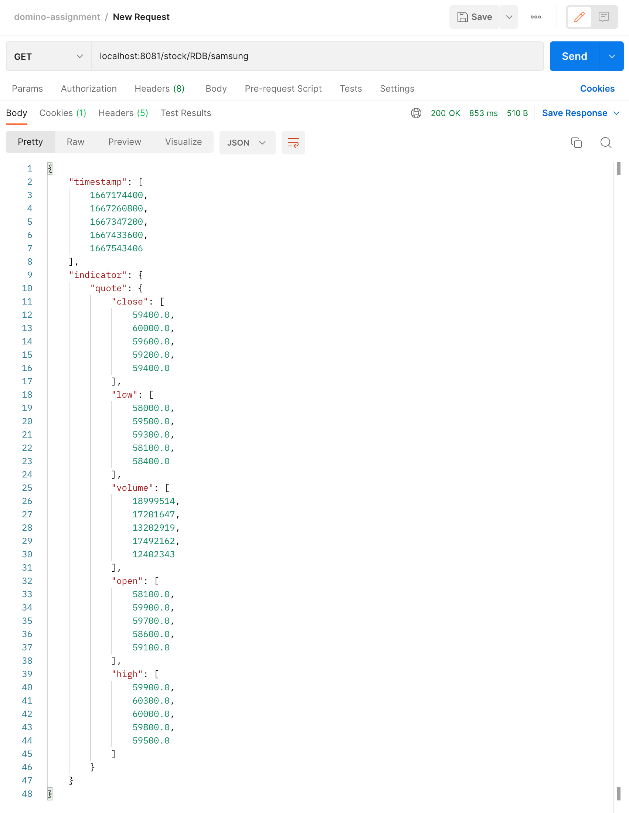
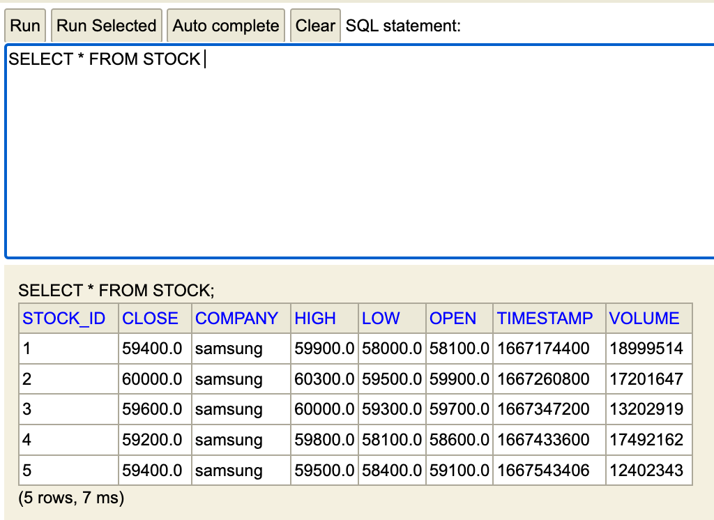
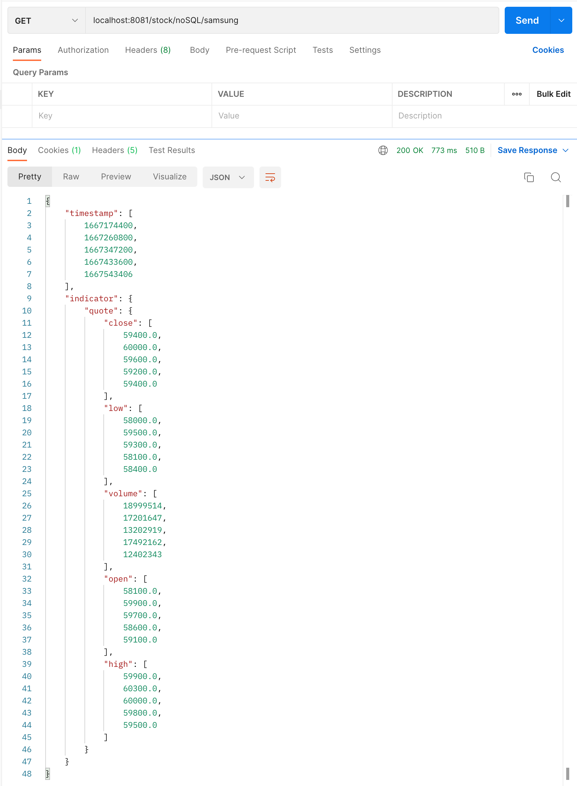
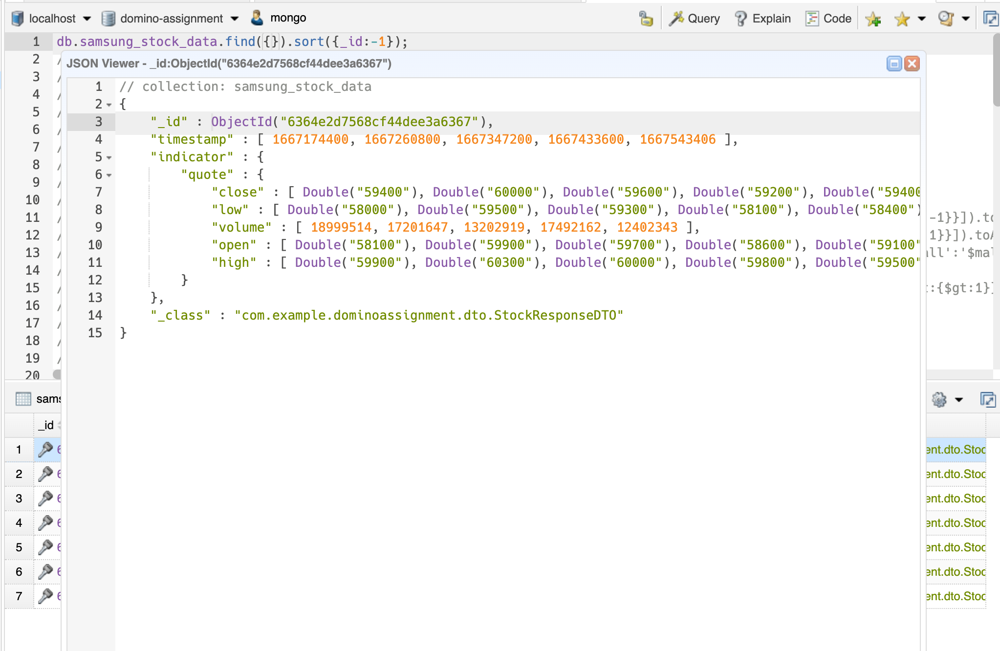

# domino-assignment

## 요구사항

- 삼성전자 주식의 (오늘포함)과거 5일치 데이터를 저장 후 출력하는 api 개발
  
- 저장 및 출력시 필요한 데이터 (최고가격: high, 최저가격: low, 개장가격: open, 종가가격: close, 거래량: volume, 거래일자: timestamp)

## 개발 과정
### 1. RDB에 데이터 저장 후 출력

- **GET** `localhost:8081/stock/RDB/samsung` 호출

  
- h2에 데이터 저장된 모습

  

### 2.회사 기술 스택에 맞추어 mongoDB를 활용하여 과제 수행
- **GET** `localhost:8081/stock/noSQL/samsung` 호출

- mongoDB에 데이터 저장된 모습

